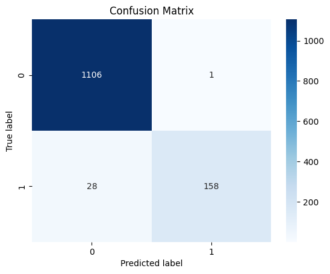

# AI 프로젝트1
## <HAM/SPAM 메시지 분류하기>

머신러닝 알고리즘을 사용해 ham/spam 메시지를 분류한다.

---
## 프로젝트 개요

2023년 메신저피싱으로 피해본 금액이 2천억원이 넘는다. 전년 대비 피해금액이 2배 상승한 것이다. 피해금액이 많지만 수사기관에는 메신저피싱을 검거할 수 있는 인력도 부족하고 검거하기가 쉽지 않다. 피해자는 매년 늘어나지만 검거율은 늘어나지 않는 현상황에서는 예방이 제일 중요하다.

메신저피싱을 예방하기 위해서는 spam 메시지인지 아닌지 헷갈리는 문자를 입력하면 이를 구분해주는 방법을 사용하면 된다. 이 방법을 실현시키기 위해 ham/spam 메시지 데이터셋을 수집하고 이를 분류하는 최적의 모델을 찾아 웹 페이지에 적용시켜 사람들이 사용할 수 있게끔 만든다.

## 사용한 라이브러리
   
   ✎sklearn 
   
   ✎NLTK
   
   ✎Matplotlib

## 프로젝트 한계
   
spam 메시지의 형식이 정해져 있는게 아니고 계속 다른 방법으로 발전하고 있기에 현재 내가 만든 웹 페이지를 상용화하는 것은 현실적으로 어렵다. 모델을 계속 업데이트 시켜서 적용하면 될 것이라 생각하지만 업데이트를 한다고 하더라고 분류를 잘못할 확률도 있어 피해가 발생할 수도 있다.

# <프로젝트 진행>

Kaggle SMS Spam Collection Dataset을 사용했다. 이 데이터셋에는 spam 또는 ham으로 분류한 5,574개의 영어로 된 메시지가 들어있다.
> https://www.kaggle.com/datasets/uciml/sms-spam-collection-dataset

***LogisticRegression*** 모델을 사용했다. LogisticRegression은 이진 분류 문제에 모델로 입력 변수의 선형 조합을 사용해 클래스 확률을 예측하고 그 확률을 기반으로 분류를 수행한다. 로지스틱 회귀를 사용했을 때 다른 모델들보다 성능이 좋게 나왔고 이진 분류에 가장 적합하다고 판단해 ham/spam 분류에서 LogisticRegression을 선택했다. 

---

### Logistic Regression

### Model 평가

---

**Flask를 통해 ham/spam 분류하는 웹 페이지 구축**

**Flask 웹 페이지 텍스트 입력 화면**

